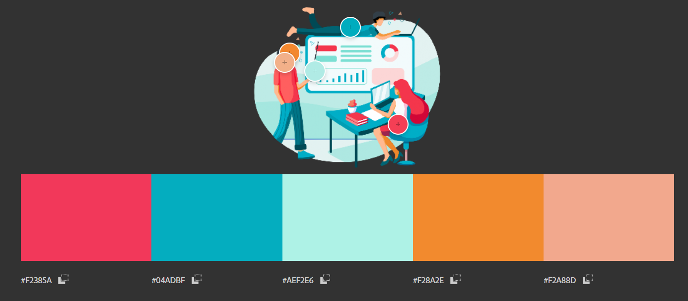
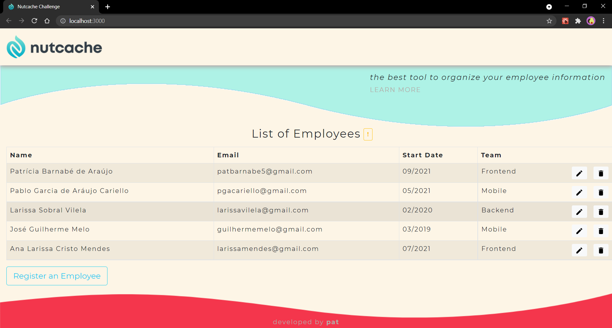
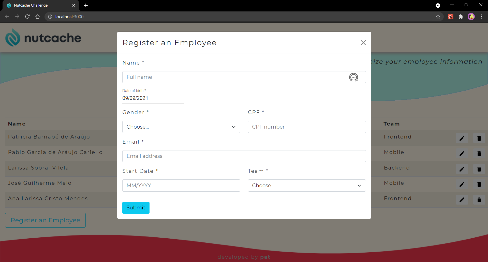
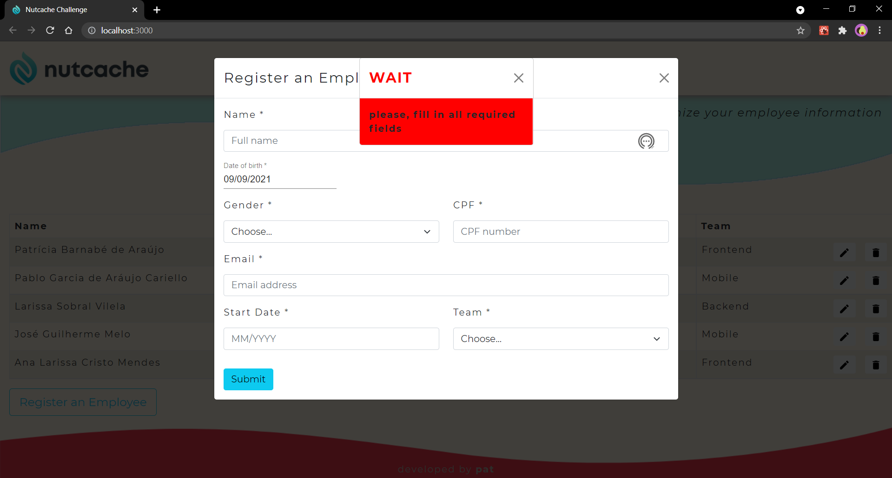

<h1 align="center">Nutcache :chestnut: Frontend Software Engineer </p>

## Technical Challenge | Application development for employee management at Nutcache Company

## Index

1. [Product Definition](#dart-product-definition)
2. [Technologies](#robot-technologies)
3. [Project Architecture](#file_folder-project-architecture)
4. [Results](#%EF%B8%8F-results)
5. [About the developer](#woman_technologist-about-the-developer)

---
## :dart: Product Definition

The [Nutcache Frontend Project](https://nutcache-challenge-patriciabarnabe.netlify.app/) is an application created to facilitate the people management, to organize all the employee information at Nutcache Company. Some implemented features:

* View the list with all employees
* Register new employees
* Remove employees
* Edit employees

### Design Thinking


---
## :robot: Technologies

* JavaScript
* React.js
* Bootstrap
* Material UI

---

## :file_folder: Project Architecture
```
.
├── 📁public
|   └── 📄index.html
|
├── 📁src
|   ├── 📁assets
|   ├── 📁components
|   |   ├── 📁Elements
|   |   |   ├── 📄List.js
|   |   |   └── 📄Register.js
|   |   |
|   |   ├── 📁Footer
|   |   |   ├── 📄Footer.css
|   |   |   └── 📄Footer.js
|   |   |
|   |   ├── 📁Header
|   |   |   ├── 📄Header.css
|   |   |   └── 📄Header.js
|   ├── 📁pages
|   |   └── 📄Main.js
|   |
|   ├── 📄global.css
|   └── 📄index.js
|   
├── 📄README.md
└── 📄package.json

```

## ✔️ Results





---
## :woman_technologist: About the developer
### Patrícia Barnabé

- [LinkedIn](https://www.linkedin.com/in/patriciabarnabe)
- E-mail: patbarnabe5@gmail.com
